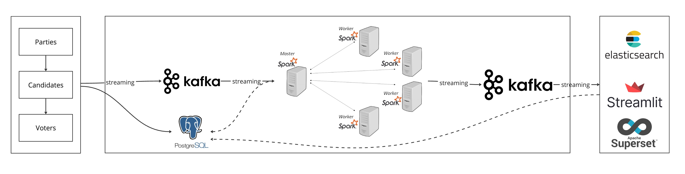
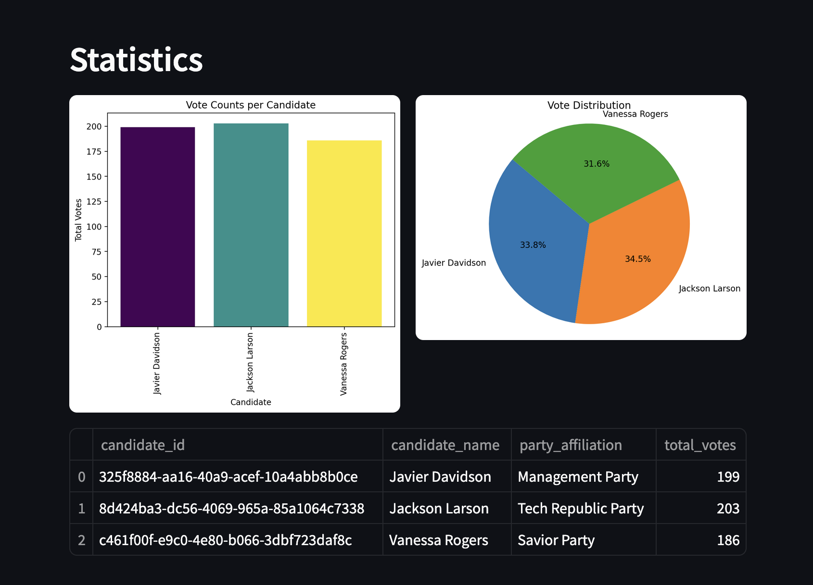
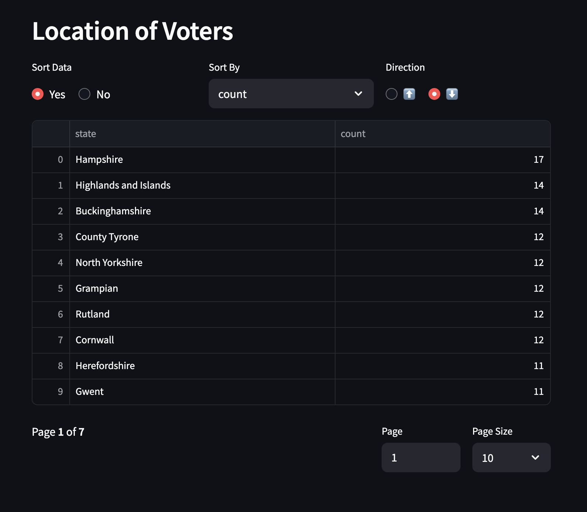

# Realtime Election Voting System

This repository hosts the source code for a real-time election voting platform. The system is designed using Python, Kafka, Spark Streaming, Postgres, and Streamlit, with all services containerized using Docker Compose for seamless setup and deployment.

---

## Architecture Overview

---

## Dashboard

---

## Components Breakdown

- **`main.py`**: Initializes PostgreSQL tables (`candidates`, `voters`, `votes`), sets up Kafka topics, and manages the flow of votes between PostgreSQL and Kafka (`voters_topic`).
- **`voting.py`**: Consumes messages from `voters_topic`, processes voting data, and sends it to `votes_topic` on Kafka.
- **`spark-streaming.py`**: Utilizes Spark Streaming to consume data from `votes_topic`, enrich it using PostgreSQL data, and publish aggregated results to dedicated Kafka topics.
- **`streamlit-app.py`**: A Streamlit interface that displays real-time voting results by consuming data from Kafka and PostgreSQL.

---

## Setup Instructions

Docker Compose is used to launch Zookeeper, Kafka, and PostgreSQL containers efficiently.

### Requirements

- Python 3.9 or newer
- Docker
- Docker Compose

